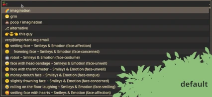
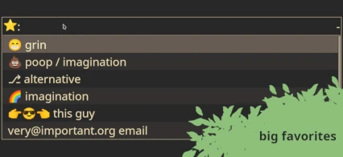

# "🍒⛏️" Emoji Cherry Pick

Choose an emoji and go wild.

* Author: Tuncay D.
* Source: https://github.com/thingsiplay/emojicherrypick
* Releases: https://github.com/thingsiplay/emojicherrypick/releases
* Update Notes: [CHANGES](CHANGES.md)
* License: [MIT License](LICENSE)

# Introduction

Are you tired of the preinstalled emoji tools that come or does not come with
your distribution? Me neither; here is it anyway.

 

(Note: The screenshots show you my personal setup of `rofi`.)

This is a commandline driven frontend and launcher to several established Linux
applications, such as `rofi`, `fzf` and `xclip`. The default behavior is to open a
`rofi` search menu to choose an emoji, that is then copied to clipboard, print
to stdout and show a notification of chosen emoji.

## Features

You can...

* copy emoji to clipboard,
* print emoji to stdout,
* simulate typing emoji to current window,
* show notification of chosen emoji,
* use a `rofi` menu to choose emoji,
* use alternative filter algorithm for `rofi` search, such as "regex" or "glob",
* use `dmenu` instead `rofi`,
* use `fzf` to make a selection in the terminal instead,
* choose emoji randomly without an interactive menu (think of the
  possibilities),
* create a favorites file with your favorite emojis (requires manual text
  editing),
* keeps track of recently used emojis,
* disable main emoji database and list favorites and recent emojis only,
* ... and more.

# Requirements

This program is a Python 3.10 script written for Linux using X11. The below
listed external tools are not stricly required to run this program. But they
are required (for obvious reasons) the moment their functionality are being
used.

### Dependencies

* `rofi`: [Github](https://github.com/davatorium/rofi) - the default active
  menu, only required when option `--menu` is set to `rofi` (default)
* `dmenu`: [Suckless](https://tools.suckless.org/dmenu/) - alternative menu,
  only required if `--menu` is set to `dmenu`
* `pmenu`: [Github](https://github.com/sgtpep/pmenu) - alternative menu, only
  required if `--menu` is set to `pmenu`
* `fzf`: [Github](https://github.com/junegunn/fzf) - alternative menu, only
  required if `--menu` is set to `fzf`
* `xclip`: [Github](https://github.com/astrand/xclip) - used to copy to
  clipboard, required if option `--clipboard` is enabled 
* `xdotool`: [Github](https://github.com/jordansissel/xdotool) - used to
  simulate typing on keyboard, required if option `--typing` is enabled
* `libnotify` / `notify-send`:
  [Gnome](https://gitlab.gnome.org/GNOME/libnotify) - used to create
  notifications, required if option `--notify` is enabled (in Manjaro provided
  with package `libnotify`)

You only need those components which are being used. Most packages should be
available in your distributions repository; maybe besides `pmenu`, which is
available as an AUR package on Manjaro/Archlinux.

The default font "*Noto Color Emoji*" can be changed, but if you are going to
leave and use it, you will need following packages:

* `noto-fonts-emoji` (on Arch, Manjaro)
* `fonts-noto-color-emoji` (on Debian, Ubuntu)

Single command to install all in one go on Manjaro:

`pamac install rofi dmenu pmenu fzf xclip xdotool libnotify noto-fonts-emoji`

# Installation

The program itself does not require any special installation process, other
than the required programs and font. Run the script from any directory you
want. Give it the executable bit, rename the script to exclude file extension
and put it into a folder that is in the systems `$PATH` . An installation
script "install.sh" is provided, but not required. I recommend to assign a
keyboard shortcut to run the program for quick access.

It is a Python 3.10 script, so therefore it requires a decent Python version on
the system. If you have an older Python version, then you might want to check
the binary [release](https://github.com/thingsiplay/emojicherrypick/releases)
package, which bundles up the script and Python interpreter to create a
standalone executable.

## Optional: Makefile and PyInstaller (you can ignore this part)

The included "Makefile" is to build the package with the standalone binary. It
will create a venv, update stuff in it and run PyInstaller from it.

# Usage

```
usage: emojicherrypick [options]
```

If you run the application the first time, it will automatically download a
small .json database with all smileys. You can prevent it from accessing the
web with the option `--offline`. This process takes about a second or so and is
only done if the file does not exist already.

## Input (choose an emoji)

There are different menu or filter systems to select an emoji from all loaded
files. The default way is the interactive graphical menu with `rofi`, which has
a search or filter bar. But the menu system can be changed to let's say `dmenu`
or even one that works in the terminal itself, let's say to `fzf`. To set a
menu system (also called engine), use the option `--menu`. At default the
selected emoji will be saved in a history file and loaded to top of menu next
time.

## Output

Once a selection is made, then the program goes into next step to output the
selection. Normally no output is done and you have to use one of the options.
Unless you run the program entirely without options, in which case the defaults
are kicking in (more about in below section). In example `-c` (short for
`--clipboard`) will cause the program to copy the selected emoji to system
clipboard. Option `-o` (short for `--stdout`) will cause the program to output
to stdout (in example to pipe to other programs).

## Default (if no options are given)

If no commandline options are given to the program, then defaults will be used.
The defaults are `-c -o -n`, to output emoji at stdout, save it to clipboard
and make a notification. Have in mind, the moment you are activating any option
manually, the program will not load the above discussed defaults and you need
to activate output manually. The above default options can be changed by
setting an environmental variable `EMOJICHERRYPICK_DEFAULT` with your custom
commandline options.

Use `emojicherrypick --help` to list all options and their brief descriptions.

## Examples

```
$ emojicherrypick --help
$ emojicherrypick -o -i
$ emojicherrypick -ci
$ emojicherrypick --typing 
$ emojicherrypick -M random --clipboard
$ emojicherrypick -g "DejaVu Sans" --clipboard
$ emojicherrypick -@ "regex" -m regex --notify --clipboard 
$ emojicherrypick --norecents -M filter -p "mouse" -i --notify --stdout
$ emojicherrypick -@⭐ --noemojis --norecents -l6 -s32 --typing
$ emojicherrypick -@custom -E -k 0 -f "./custom.cherry" -o
```

## Favorites (custom .cherry files)

You can have a sort of "bookmarks" of your favorite emojis by creating and
editing a text file. The program will always show them on top of the menu. The
location is at "~/.config/emojicherrypick/favorites.cherry" and has the same
format as the "recents.cherry" and "emojis.cherry" format:

```
EMOJI DESCRIPTION
```

Everything until first space is considered an emoji and it even works with text
only too. An example "favorites.cherry":

```
🌈 imagination
💩 poop
👉😎👈 this guy
⎇ alternative
very@important.org email
```

Depending on the application or font, some emojis may be not visible to you.

# Additional files in use

These files are created by the script or optionally by the user.

## created automatically

* `~/.cache/emojicherrypick/emojis.json`
* `~/.cache/emojicherrypick/emojis.cherry`
* `~/.cache/emojicherrypick/recents.cherry`
 
"emojis.json" will be downloaded from following Github Gists link
"[@thingsiplay/emojis.json](https://gist.githubusercontent.com/thingsiplay/1f500459bc117cf0b63e1f5c11e03963/raw/d8e4b78cfe66862cf3809443c1dba017f37b61db/emojis.json)"
which is forked from
"[@oliveratgithub/emojis.json](https://gist.github.com/oliveratgithub/0bf11a9aff0d6da7b46f1490f86a71eb)"
, unless the file already exists on the disk. The other files are created
automatically by the program.

## optional user created data

* `~/.config/emojicherrypick/favorites.cherry`

"favorites.cherry" can be a user created list of cherries (emojis) and will be
loaded up automatically if present.

